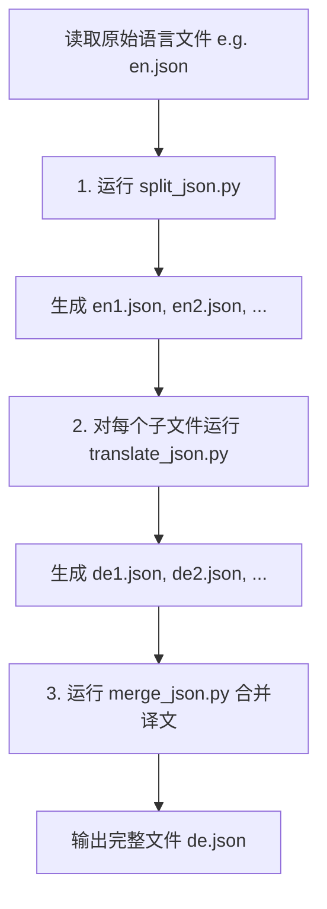

# i18n 多语言处理流程说明

本文档介绍项目中多语言（i18n）JSON 文件的处理流程，包括 **拆分（split）**、**翻译（translate）** 与 **合并（merge）** 的完整步骤。
所有操作均在 `translate/` 目录下执行。

---

## 一、文件拆分（Split JSON）

当某个语言文件（如 `en.json`）过大时，可以通过 `split_json.py` 将其拆分为多个较小的 JSON 文件，以便翻译与维护。

### 执行命令：

```bash
cd translate/

# 执行默认拆分（每个文件最多 2000 行）
python split_json.py en

# 或指定每个文件的最大行数
python split_json.py en --max-lines 1500
```

📁 **脚本行为说明：**

`split_json.py` 会自动执行以下步骤：
- **读取原始文件**：`../public/locales/en.json`
- **若目标目录不存在，则自动创建**：`../public/locales/en/`
- **按顶层 key 智能拆分**为多个小文件，例如：
  - `en1.json`
  - `en2.json`
  - `en3.json`
  - ...
- **确保**每个子文件的行数低于设定的上限。
- **确保** JSON 结构与键名完整保留。

---

## 二、文件翻译（Translate JSON）

拆分完成后，使用 `translate_json.py` 对每个子文件进行翻译。

**翻译命令格式：**
`python translate_json.py "public/locales/en/en1.json" "public/locales/de/de1.json" de`

此命令会将英文文件 `en1.json` 翻译为德语（German）文件 `de1.json`。翻译完成后，生成的译文文件将保存在 `public/locales/de/` 目录中。

⚠️ **提示**：需逐个对子文件运行翻译命令（例如 `en1.json` ~ `en14.json`）。

---

## 三、文件合并（Merge JSON）

当所有拆分文件翻译完成后，可通过 `merge_json.py` 将它们重新合并为一个完整文件。

**合并命令示例：**
```bash
python3 merge_json.py hi
```

**合并脚本行为：**
- **顺序读取**多个分段 JSON 文件（如 `hi1.json` ~ `hi14.json`）。
- **按顺序拼接**为完整文件 `hi.json`。
- **检查**键名重复与结构正确性。
- **生成最终的完整翻译文件**：`public/locales/hi/hi.json`

---

## 流程图（Mermaid）



---

## 注意事项

- **代码一致**：确保拆分、翻译、合并使用的语言代码一致（如 `en` → `de`、`en` → `fr`）。
- **语法检查**：翻译前务必检查源 JSON 语法是否正确。
- **文件顺序**：合并时，输入的子文件顺序必须与拆分时一致，以保证最终文件的结构正确。
- **中断恢复**：若翻译流程中断，可手动继续执行剩余文件的翻译命令。
- **文件路径**：最终生成的文件路径统一为 `public/locales/<LANG>/<LANG>.json`。

---

## 最终生成文件示例

- `public/locales/de/de.json`
- `public/locales/hi/hi.json`
- `public/locales/fr/fr.json`
